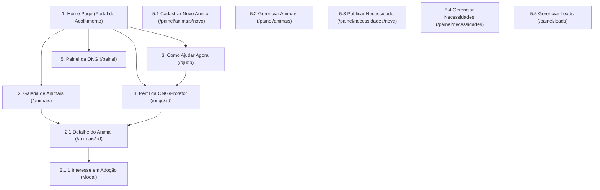
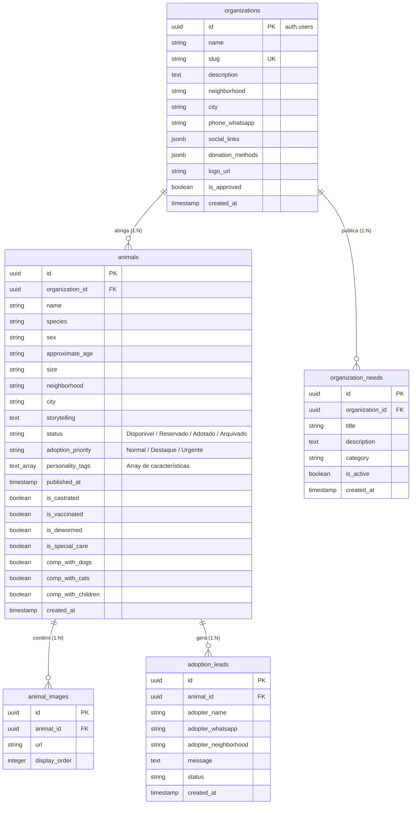
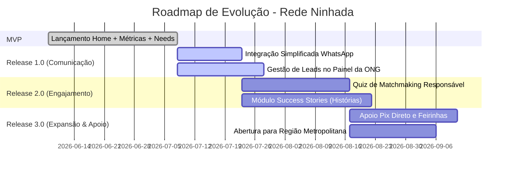

# Rede Ninhada — Especificação Técnica e de Produto (MVP)

Esta especificação define o desenvolvimento da **Rede Ninhada**, um **Hub de Acolhimento e Apoio à Causa Animal** focado inicialmente em São Luís (MA) e região metropolitana. A arquitetura foi desenhada para operação em **Custo Zero** (Supabase Free + Vercel Hobby), otimização de mídias no frontend e facilidade de manutenção por uma desenvolvedora solo.

---

## 1. Princípios da Rede Ninhada

Todas as decisões de produto, design e código devem ser guiadas por estes seis princípios fundamentais. Se uma funcionalidade ferir um desses princípios, ela deve ser descartada ou repensada:

1.  **Animais não são produtos:** A interface não deve se parecer com um e-commerce ou marketplace. Evitamos termos comerciais (ex: "vitrine", "carrinho", "checkout", filtros por "preço/raça pura").
2.  **Adoção responsável é mais importante que volume:** O foco é a qualidade e a segurança da conexão entre o animal e o adotante.
3.  **Toda forma de ajuda tem valor:** Doar suprimentos, oferecer Lar Temporário (LT), voluntariar-se ou simplesmente compartilhar perfis é tão importante quanto adotar.
4.  **A tecnologia deve fortalecer a rede:** A plataforma é um facilitador que direciona as pessoas para as conexões humanas e físicas locais (ONGs, WhatsApp, feiras).
5.  **Valorização de ONGs e Protetores:** Visibilidade e respeito ao trabalho exaustivo de protetores independentes e organizações locais de São Luís.
6.  **Simplicidade operacional e custo zero:** A arquitetura deve ser simples de manter por uma desenvolvedora solo e usar apenas serviços grátis.

---

## 2. Visão Geral & Proposta de Valor

*   **Nome Oficial:** Rede Ninhada
*   **Proposta de Valor:**
    > *"A Rede Ninhada conecta animais, protetores, organizações e pessoas que desejam ajudar, fortalecendo a rede de acolhimento animal de São Luís e região."*
*   **Diretrizes de Interface (UI/UX) de Acolhimento:**
    *   **Paleta de Cores:** Fundo creme aconchegante (`#FAF7F2`), roxo suave (comunidade e acolhimento) e laranja pêssego (CTAs e destaques prioritários).
    *   **Identidade Visual:** Espaçamento generoso, tipografia humanista e cards de cantos suaves. Foco no storytelling do animal e nas dores da comunidade (necessidades reais de suprimentos, lares temporários e voluntariado).

### 2.1 Refinamento de Posicionamento (Testes de Comunicação do Hero)
Embora a mensagem principal do MVP seja mantida, estão documentadas alternativas de texto para testes de comunicação futuros:
*   *Padrão (MVP):* **"Uma rede de acolhimento para animais e pessoas."**
*   *Alternativa A:* "Conectando animais, protetores e pessoas que desejam ajudar."
*   *Alternativa B:* "Toda forma de ajudar importa."
*   *Alternativa C:* "Juntos por mais histórias de acolhimento."
*   *Alternativa D:* "Fortalecendo a rede de proteção animal da nossa comunidade."

---

## 3. Arquitetura de Informação & UX

### 3.1 Sitemap do MVP



### 3.2 Estrutura de Telas (Home Page)

```
┌─────────────────────────────────────────────────────────────┐
│                       HEADER & NAV                          │
├─────────────────────────────────────────────────────────────┤
│ 1. HERO SECTION                                             │
│    "Uma rede de acolhimento para animais e pessoas."        │
│    [Quero Adotar]  [Conhecer ONGs]  [Como Ajudar]           │
├─────────────────────────────────────────────────────────────┤
│ 2. MÉTRICAS DE IMPACTO DA REDE                              │
│    Calculadas automaticamente com base no banco de dados    │
│    🐾 XX animais cadastrados   🏡 XX adoções realizadas     │
│    🤝 XX ONGs parceiras        ❤️ XX necessidades atendidas │
├─────────────────────────────────────────────────────────────┤
│ 3. COMO VOCÊ PODE AJUDAR HOJE?                              │
│    [Adotar] [Doar] [Oferecer LT] [Voluntariar] [Divulgar]   │
├─────────────────────────────────────────────────────────────┤
│ 4. ANIMAIS AGUARDANDO UM LAR                                │
│    Grid de cards com badges lógicos e tempo de espera       │
├─────────────────────────────────────────────────────────────┤
│ 5. NECESSIDADES URGENTES DA REDE                            │
│    Cards dinâmicos de necessidades das ONGs                 │
├─────────────────────────────────────────────────────────────┤
│ 6. ONGS E PROTETORES PARCEIROS                              │
│    Logos e links das organizações homologadas               │
├─────────────────────────────────────────────────────────────┤
│ 7. HISTÓRIAS DE ACOLHIMENTO                                 │
│    Seção visual indicando histórias reais de sucesso        │
├─────────────────────────────────────────────────────────────┤
│                       FOOTER INSTITUCIONAL                  │
└─────────────────────────────────────────────────────────────┘
```

### 3.3 UX dos Cards de Animais: Tempo de Espera & Badges de Contexto

Para gerar maior conexão humana sem complicar o banco de dados, o frontend utilizará regras lógicas em cima das tabelas existentes:

#### 1. Cálculo de Tempo Aguardando Adoção
A partir do campo `published_at` (obtido do banco de dados), o frontend fará o cálculo de diferença de dias em tempo real para exibir o texto explicativo:
*   Diferença < 30 dias: *"Aguardando há X dias"* (ex: *"Aguardando há 15 dias"*)
*   Diferença entre 30 e 365 dias: *"Aguardando há X meses"* (ex: *"Aguardando há 3 meses"*)
*   Diferença > 365 dias: *"Aguardando há X ano(s)"* (ex: *"Aguardando há 1 ano"*)

#### 2. Selos Visuais de Contexto (Badges Lógicos)
O card de cada animal apresentará badges (selos) criados de acordo com as seguintes regras de negócio executadas no frontend:
*   `adoption_priority = 'Urgente'` ➔ **🚨 Urgente**
*   `is_special_care = true` ➔ **🏥 Necessita Cuidados** (animais amputados, cegos, idosos ou doentes crônicos)
*   `status = 'Disponivel'` e `published_at` há mais de 90 dias ➔ **💜 Espera Longa**
*   `is_special_care = true` ou alguma flag de temperamento especial ➔ **🧡 Caso Especial**
*   `adoption_priority = 'Destaque'` ➔ **⭐ Destaque**
*   Se o animal for listado em uma necessidade de Lar Temporário ativa da ONG ➔ **🏠 Busca Lar Temporário**

*Exemplo Visual do Bloco "Sobre Mim" na página de detalhes do animal:*
> 🐾 **Carinhoso** &nbsp;&nbsp; 🐾 **Gosta de outros gatos** &nbsp;&nbsp; 🐾 **Ama colo** &nbsp;&nbsp; 🐾 **Energia moderada**

---

## 4. Modelagem do Banco de Dados (PostgreSQL)

O banco de dados foi projetado de forma neutra para permitir a **Expansão Regional Futura** (como São José de Ribamar, Paço do Lumiar, Raposa e interior do Maranhão).
*   O campo `city` é editável e livre.
*   Os bairros de São Luís listados na seção 5.1 serão validados no frontend. Ao expandir para outra cidade, basta adicionar a lista de bairros correspondente ao frontend mapeada sob a respectiva cidade.



### Script DDL do Banco de Dados

```sql
-- Habilitar extensão para UUID
CREATE EXTENSION IF NOT EXISTS "uuid-ossp";

-- 1. Organizações / Protetores
CREATE TABLE public.organizations (
    id UUID PRIMARY KEY,
    name VARCHAR(150) NOT NULL,
    slug VARCHAR(150) UNIQUE NOT NULL,
    description TEXT,
    neighborhood VARCHAR(100) NOT NULL,
    city VARCHAR(100) DEFAULT 'São Luís' NOT NULL,
    phone_whatsapp VARCHAR(20) NOT NULL,
    social_links JSONB DEFAULT '{}'::jsonb,
    donation_methods JSONB DEFAULT '{}'::jsonb,
    logo_url VARCHAR(500),
    is_approved BOOLEAN DEFAULT FALSE NOT NULL,
    created_at TIMESTAMP WITH TIME ZONE DEFAULT CURRENT_TIMESTAMP NOT NULL
);

-- 2. Animais
CREATE TABLE public.animals (
    id UUID PRIMARY KEY DEFAULT gen_random_uuid(),
    organization_id UUID NOT NULL REFERENCES public.organizations(id) ON DELETE CASCADE,
    name VARCHAR(100) NOT NULL,
    species VARCHAR(50) NOT NULL,
    sex VARCHAR(10) NOT NULL,
    approximate_age VARCHAR(50) NOT NULL,
    size VARCHAR(20) NOT NULL,
    neighborhood VARCHAR(100) NOT NULL,
    city VARCHAR(100) DEFAULT 'São Luís' NOT NULL,
    storytelling TEXT NOT NULL,
    status VARCHAR(50) DEFAULT 'Disponivel' NOT NULL, 
    adoption_priority VARCHAR(20) DEFAULT 'Normal' NOT NULL,
    personality_tags TEXT[] DEFAULT '{}'::TEXT[] NOT NULL,
    published_at TIMESTAMP WITH TIME ZONE DEFAULT CURRENT_TIMESTAMP NOT NULL,
    is_castrated BOOLEAN DEFAULT FALSE NOT NULL,
    is_vaccinated BOOLEAN DEFAULT FALSE NOT NULL,
    is_dewormed BOOLEAN DEFAULT FALSE NOT NULL,
    is_special_care BOOLEAN DEFAULT FALSE NOT NULL,
    comp_with_dogs BOOLEAN DEFAULT TRUE NOT NULL,
    comp_with_cats BOOLEAN DEFAULT TRUE NOT NULL,
    comp_with_children BOOLEAN DEFAULT TRUE NOT NULL,
    created_at TIMESTAMP WITH TIME ZONE DEFAULT CURRENT_TIMESTAMP NOT NULL,
    CONSTRAINT chk_animal_status CHECK (status IN ('Disponivel', 'Reservado', 'Adotado', 'Arquivado')),
    CONSTRAINT chk_adoption_priority CHECK (adoption_priority IN ('Normal', 'Destaque', 'Urgente'))
);

-- 3. Necessidades das Organizações
CREATE TABLE public.organization_needs (
    id UUID PRIMARY KEY DEFAULT gen_random_uuid(),
    organization_id UUID NOT NULL REFERENCES public.organizations(id) ON DELETE CASCADE,
    title VARCHAR(150) NOT NULL,
    description TEXT NOT NULL,
    category VARCHAR(50) NOT NULL,
    is_active BOOLEAN DEFAULT TRUE NOT NULL,
    created_at TIMESTAMP WITH TIME ZONE DEFAULT CURRENT_TIMESTAMP NOT NULL,
    CONSTRAINT chk_need_category CHECK (category IN ('Ração', 'Medicamentos', 'Lar temporário', 'Voluntários', 'Transporte', 'Eventos', 'Outros'))
);

-- 4. Imagens de Galeria
CREATE TABLE public.animal_images (
    id UUID PRIMARY KEY DEFAULT gen_random_uuid(),
    animal_id UUID NOT NULL REFERENCES public.animals(id) ON DELETE CASCADE,
    url VARCHAR(500) NOT NULL,
    display_order INT DEFAULT 0 NOT NULL,
    created_at TIMESTAMP WITH TIME ZONE DEFAULT CURRENT_TIMESTAMP NOT NULL
);

-- 5. Leads de Adoção
CREATE TABLE public.adoption_leads (
    id UUID PRIMARY KEY DEFAULT gen_random_uuid(),
    animal_id UUID NOT NULL REFERENCES public.animals(id) ON DELETE CASCADE,
    adopter_name VARCHAR(150) NOT NULL,
    adopter_whatsapp VARCHAR(20) NOT NULL,
    adopter_neighborhood VARCHAR(100) NOT NULL,
    message TEXT NOT NULL,
    status VARCHAR(50) DEFAULT 'Novo' NOT NULL,
    created_at TIMESTAMP WITH TIME ZONE DEFAULT CURRENT_TIMESTAMP NOT NULL,
    CONSTRAINT chk_lead_status CHECK (status IN ('Novo', 'Em Contato', 'Aprovado', 'Rejeitado'))
);

-- Índices otimizados
CREATE INDEX idx_animals_search_lookup ON public.animals(species, status, city, neighborhood, adoption_priority);
CREATE INDEX idx_needs_active_lookup ON public.organization_needs(is_active, category);
CREATE INDEX idx_animals_published ON public.animals(published_at DESC);
```

---

## 5. Dicionários de Dados Estáticos (Frontend)

Para manter a consistência tributária e de taxonomia local no MVP, estes dados serão codificados no Frontend.

### 5.1 Bairros de São Luís (MA)
```json
[
  "Anjo da Guarda", "Araçagi", "Areinha", "Bairro de Fátima", "Bequimão", 
  "Calhau", "Centro", "Chácara Brasil", "Cidade Operária", "Cidade Olímpica", 
  "Cohama", "Cohatrac", "Coroadinho", "Cruzeiro do Anil", "Estiva", 
  "Ipase", "Itaqui-Bacanga", "Jaracaty", "Jardim Eldorado", "Jardim Renascença", 
  "Litorânea", "Maranhão Novo", "Monte Castelo", "Olho d'Água", "Parque Shalon", 
  "Ponta d'Areia", "Ponta do Farol", "Recanto dos Vinhais", "Rio Anil", 
  "São Cristóvão", "São Francisco", "Turu", "Vinhais"
]
```

### 5.2 Tags de Personalidade Autorizadas (`personality_tags`)
```json
[
  "Carinhoso", "Brincalhão", "Tranquilo", "Independente", "Sociável", 
  "Tímido", "Energético", "Gosta de colo", "Dócil", "Protetor", "Silencioso"
]
```

---

## 6. Lógica das Métricas de Impacto (Backend/SQL)

As métricas exibidas na Home Page serão alimentadas por consultas rápidas e de baixo custo no banco de dados do Supabase. Como desenvolvedora solo, você pode expor essas contagens via uma API Serverless simples no Next.js ou chamando funções SQL remotas (RPC):

*   **Animais Divulgados:** `SELECT COUNT(*) FROM animals;`
*   **Adoções Realizadas:** `SELECT COUNT(*) FROM animals WHERE status = 'Adotado';`
*   **Organizações Participantes:** `SELECT COUNT(*) FROM organizations WHERE is_approved = true;`
*   **Necessidades Atendidas:** `SELECT COUNT(*) FROM organization_needs WHERE is_active = false;`

---

## 7. Roadmap de Evolução pós-MVP (Foco: Dev Solo)

O roadmap consolida a evolução futura sem inflar o escopo do MVP.



### Detalhes das Evoluções Futuras (Roadmap)

#### Módulo Success Stories (`success_stories`) — Planejado para a Release 2.0
Mapeamento de banco de dados planejado para armazenar histórias reais de adoções felizes:
```sql
CREATE TABLE public.success_stories (
    id UUID PRIMARY KEY DEFAULT gen_random_uuid(),
    organization_id UUID REFERENCES public.organizations(id) ON DELETE SET NULL,
    title VARCHAR(150) NOT NULL,
    story TEXT NOT NULL,
    cover_image VARCHAR(500) NOT NULL,
    created_at TIMESTAMP WITH TIME ZONE DEFAULT CURRENT_TIMESTAMP NOT NULL
);
```

#### Expansão Regional (Região Metropolitana) — Planejado para a Release 3.0
Abertura de suporte a municípios vizinhos (São José de Ribamar, Paço do Lumiar, Raposa e outros municípios do Maranhão).
*   **Ajuste de UX:** O dropdown de localização passará a exibir primeiro a seleção de `Cidade` e, com base nela, renderizará a lista de `Bairros` específica do município correspondente.
